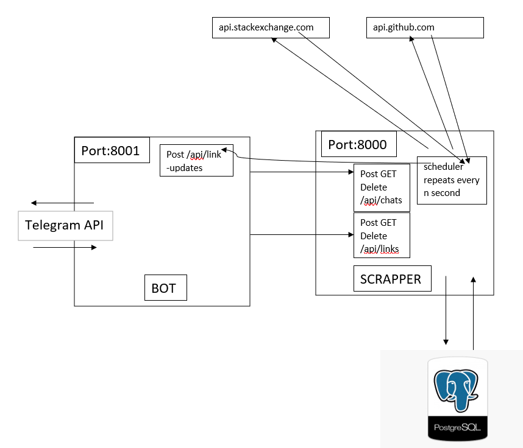
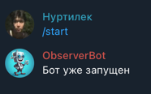
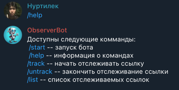
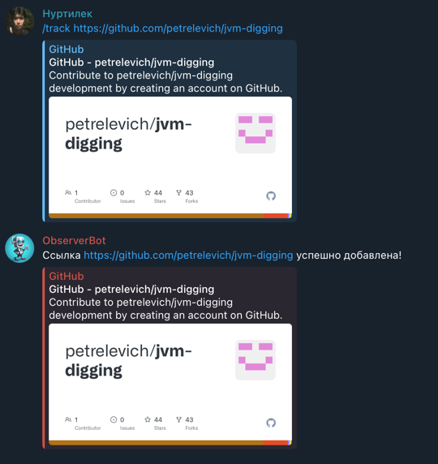
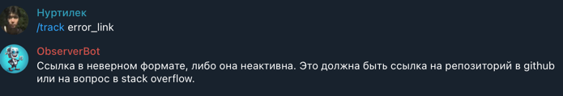
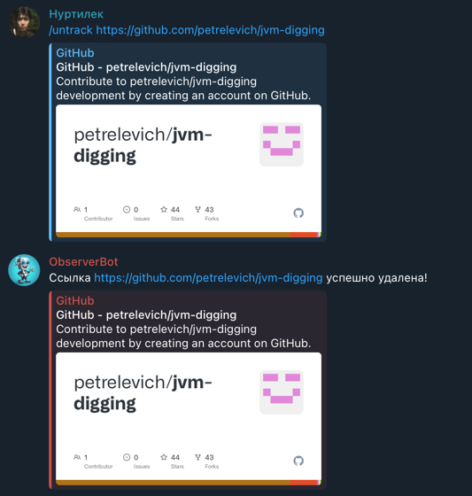
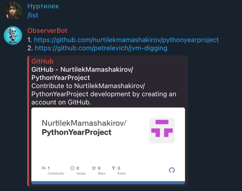
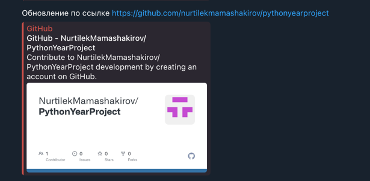

ФЕДЕРАЛЬНОЕ ГОСУДАРСТВЕННОЕ АВТОНОМНОЕ ОБРАЗОВАТЕЛЬНОЕ УЧРЕЖДЕНИЕ ВЫСШЕГО ОБРАЗОВАНИЯ
«НАЦИОНАЛЬНЫЙ ИССЛЕДОВАТЕЛЬСКИЙ УНИВЕРСИТЕТ
«ВЫСШАЯ ШКОЛА ЭКОНОМИКИ» МОСКОВСКИЙ ИНСТИТУТ ЭЛЕКТРОНИКИ И МАТЕМАТИКИ

### **Самостоятельной работы по индивидуальному плану по курсу**
### **«Проектный семинар “Python в науке о данных”»**

Выполнили студенты группы БИВ238: 
+ Данилова Ева Владимировна,
+ Мамашакиров Нуртилек Жанабидинович,
+ Сатаров Владимир Евгеньевич.

### **Тема работы:**
 **Реализация бота, отслеживающего обновления на Stack OverFlow**

Руководитель: 
+ Ролич Алексей Юрьевич

### **Москва 2024**
# Документация для разработчика
## Оглавление:
+ Описание приложения;
  + Основные команды;
  + Приложение обеспечивает;
+ Требования для работы;
  + Требования к компьютеру;
  + Требования для запуска;
+ Описание архитектуры;
+ Тесты;

## Описание приложения

[Телеграм-бот](https://t.me/ObserverJavaBot)  служит для отслеживания обновлений на сайтах [Stack Overflow](https://stackoverflow.com/) и [GitHub](https://github.com/) по определенным ссылкам. Пользователь может добавлять ссылки на вопросы, ответы, комментарии или репозитории, которые он хочет отслеживать. Бот будет уведомлять пользователя о новых ответах, комментариях, коммитах, пулл-реквестах и о других изменениях по этим ссылкам.

### Основные команды [Телеграм-бота](https://t.me/ObserverJavaBot):
+ */help* - список всех команд;
+ */start* - запуск бота;
+ */track* - начать отслеживать ссылку;
+ */untrack* - закончить отслеживание ссылки;
+ */list* - список отслеживаемых ссылок.

### Приложение обеспечивает:
+ Вторизацию пользователя (при первом обращении к боту  id пользователя сохраняется в базу данных);
+ Сохранение ссылок для каждого пользователя;
+ Оповещение пользователя об обновлениях по сохраненной ссылке;
+ Получение списка сохраненных ссылок пользователя.

## Требования для работы
### Требования к компьютеру:
+ Приложение написано для операционной системы Windows 64-х разрядной, MacOS.
Ресурсы компьютера: код не требует значительных ресурсов, поэтому минимальные системные требования будут зависеть только от требований самого интерпретатора Python:
2 и более ядерный процессор
3 и более ГБ оперативной памяти
требуемое место на диске: 1 ГБ (сам архив с приложением занимает около 1,5 Мб).
### Требования для запуска:
+ Наличие установленного и работоспособного редакторока кода, как [PyCharm](https://www.jetbrains.com/pycharm/)/[VS Code](https://code.visualstudio.com/);
+ Успешное клонирование репозитория по [URL](https://github.com/NurtilekMamashakirov/PythonYearProject.git) в новый проект;

+ Установка всех нужных модулей и библиотек из **requiements.txt**;
>Установка осуществляется засчет ввода в терминал определенной команды:
`pip install -r requirements.txt`

+ Затем можно запускать программу с помощью ввода команды в терминал;
>`pyton scrapper/manage.py runserver 8000` - запуск сервиса scrapper  
>`python bot/manage.py runserver 8001` - запуск сервиса bot  
>`python bot/manage.py bot` - запуск bot

+ Запуск [Телеграм-бота](https://t.me/ObserverJavaBot);
  + Прописать команду */start*;
  + Прописать команду */help* для ознакомления с остольными командами.

## Описание архитектуры
### Архитектура приложения:
+ Telegram bot - основной функционал для взаимодействия с пользователем. Бот будет реализован с использованием библиотеки Python-telegram-bot и будет обмениваться данными с пользователями через Telegram API. (Реализован в модуле Bot)
+ Web-приложение с использованием фреймворка Django - данная часть приложения будет отвечать за обработку запросов пользователей, сохранение данных в базу данных, отслеживание обновлений по ссылкам и оповещение бота об обновлениях. (Реализован в модуле Scrapper)
+ База данных PostgreSQL - используется для хранения информации о пользователях, ссылках и связях между этими сущностями. Создаются 3 таблицы на основе моделей Django: Chat, Link и связующая таблица. Таблица Chat имеет 1 столбец, хранящий id чатов (id чата в телеграмме). Таблица Link имеет 3 столбца: id (генерируется автоматически 1,2,3...), url (ссылка), updated_at (время последнего обновления). Связующая таблица Chat_Links содержит 3 столбца: id, chat_id (id чата), link_id (id ссылки).
### Схема работы:

### Работа приложения:
+ Модуль Bot:
  + main/management/commands/bot.py:
    + handle(message: telebot.types.Message) - прописан функционал обработки всех сообщений пользователей, запускается бот. Ничего не возрващается.
    + start_handler(message: telebot.types.Message) - обработка при команде /start, ничего не возрващает
    + help_handler(message: telebot.types.Message) - обработка при команде /help, ничего не возвращает
    + track_handler(message: telebot.types.Message) - обработка при команде /track, ничего не возрващает
    + untrack_handler(message: telebot.types.Message) - обработка при команде /untrack, ничего не возвращает
    + list_handler(message: telebot.types.Message) - обработка при команде /list, ничего не возвращает
  + main/views.py:
    + класс LinkUpdatesView (обрабатывает запросы на /api/link_updates):
      + post(self, request) - обрабатывает post-запросы. Принимает ссылку, по которому поступило обновление, со всеми его чатами и оповещает об этом пользователей. Возваращет пустой Response. 
  + main/utils.py:
    + link_is_available(link: str) - проверка на формат ссылки и проверка работоспособности ссылки.
+ Модуль scrapper:
  + main/models.py - описаны модели Chat и Link
  + main/views.py - описана обработка при обращении на "api/links" и "api/chats"
  + main/jobs/scheduler.py - описан функционал выявления обновлений по ссылкам и оповещение об этом бота.

### Тесты:

